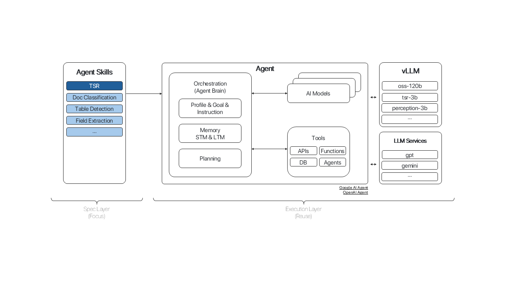
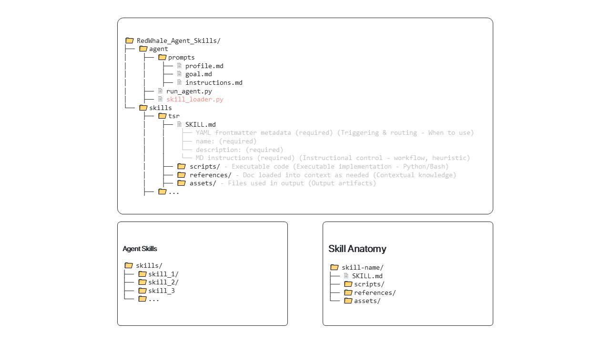

# Agent Skills – TSR Prototype

This repository implements an **Agent Skills architecture** that combines **Claude-style Skill concepts and anatomy** with an **OpenAI Agent runtime (function calling)** to build modular, domain-specific agents.

The current focus is a **Table Structure Recognition (TSR)** prototype, which serves as a concrete example of how Agent Skills enable scalable, task-specific agent behavior.

---






---

## 1. Goal of This Project

**Build Modular Agent Skills for a TSR Prototype**

* **Agent** → Autonomous, minimizing human intervention
* **Skills** → Task-specific, modular capabilities
* **TSR (Task)** → Table Structure Recognition
* **Prototype** → Simple, end-to-end functional, modular, and extensible

The goal is **not** to build a single TSR pipeline, but to validate a **general Agent Skills architecture** that can be extended to many domains, tasks, and skills.

---

## 2. What Are Agent Skills?

**Agent Skills** are **modular capabilities** that extend an Agent’s functionality.

They are:

* **Task-specific**
* **Activated only when needed**
* **Automatically selected by the Agent**

### Examples of Skills

* Table Structure Recognition (TSR)
* Table Detection
* Document Classification
* Document Summarization
* Field Extraction

From a developer’s perspective, a Skill is simply a **folder** with a clear structure and contract.

### Definition

> **Agent Skills** are modular capabilities that package instructions, metadata, and optional resources (scripts, references, assets) that an Agent uses automatically when relevant.

---

## 3. Why Do We Need Agent Skills?

### 3.1 Domain / Task Expertise

LLMs are generalists. Real-world tasks require **specialized expertise**.

**Example**
To prepare a tax report, you would choose a **tax professional**, not a mathematician with an IQ of 200.

Agent Skills encode **domain and task expertise explicitly**, instead of relying on generic prompting.

---

### 3.2 Modular & Extensible Design

Agent Skills are independent modules that can be extended **without modifying the Agent core**.

```
skills/
├── tsr/
├── table_detection/
├── document_classification/
├── document_summarization/
├── field_extraction/
└── ...
```

New capabilities can be added simply by **dropping in a new Skill folder**.

---

## 4. Project Structure

```
demo_skill_openai_agent/
├── skills/
│   └── string-utils/
│       ├── SKILL.md
│       ├── scripts/
│       │   └── string_utils.py
│       ├── references/
│       │   └── rules.md
│       └── assets/
│           └── README.txt
└── agent/
    ├── skill_loader.py
    └── run_agent.py
```

---

## 5. Skill Anatomy

### 5.1 Folder Structure

```
skill-name/
├── SKILL.md
├── scripts/
├── references/
└── assets/
```

### 5.2 Detailed Anatomy

```
skill-name/
├── SKILL.md (required)
│   ├── YAML frontmatter metadata (required)
│   │   ├── name         # Skill identity
│   │   └── description  # Triggering & routing (when to use)
│   └── Markdown instructions (required)
│       # Workflow, heuristics, usage guidance
└── Bundled resources (optional)
    ├── scripts/     # Executable implementations (Python/Bash)
    ├── references/  # Docs loaded into context on demand
    └── assets/      # Files used in output
```

* **Metadata** → Used for discovery and routing
* **Instructions** → Control agent behavior and workflow
* **Resources** → Enable deterministic execution and structured output

---

## 6. Two-Layer Architecture

### 6.1 Spec Layer (Agent Skills) — *Primary Focus*

Defines **what the Agent can do**:

* Task semantics
* Domain knowledge
* Workflow and heuristics

Examples:

* TSR
* Document Classification
* Table Detection
* Field Extraction

This layer provides the **main research and system-level value**.

---

### 6.2 Execution Layer (OpenAI Agent)

Responsible for **how tasks are executed**:

* Tool calling
* Code execution
* Result integration
* Iterative agent loop

This layer largely **reuses existing OpenAI / agent infrastructure**, which is already well optimized.

---

## 7. How Agent Skills Work

Agent Skills are **model-invoked**.

The Agent automatically decides which Skills to use based on the user request.
Users **do not explicitly call a Skill**.

---

### 7.1 Discovery

* At startup, the Agent loads **only**:

  * `name`
  * `description`
* Keeps startup fast
* Provides sufficient context for routing

---

### 7.2 Activation

* When a request matches a Skill’s description:

  * The Skill is activated
  * The full `SKILL.md` body is loaded into context
* Descriptions should reflect **natural user language** for reliable matching

---

### 7.3 Execution

* The Agent follows the Skill’s instructions
* Loads referenced documents if needed
* Executes bundled scripts via tool calling
* Produces deterministic outputs

---

## 8. Progressive Disclosure

To minimize context usage, the system applies **three levels of loading**:

### Level 1 – Metadata Only

* Load: `name`, `description`
* Purpose: routing

### Level 2 – SKILL.md Body

* Loaded when the Skill is activated
* Provides workflow and heuristics

### Level 3 – References On-Demand

* Loaded only if referenced in `SKILL.md`
* Used for detailed rules or formats

➡️ This approach minimizes noise, cost, and hallucinations.

---

## 9. End-to-End Flow

### A. Loader / Adapter

`load_all_skills()` → *turn Skill folders into Tools + Executors*

**Input**

* Path to `skills/`

**Output**

* `tools`: list of tool schemas passed to `client.responses.create(...)`
* `runtime["executors"]`: mapping `{tool_name: python_callable}`

**Mechanism**

* Iterate through folders in `skills/`
* Skip invalid skill folders (hidden folders or missing `SKILL.md`)
* Parse `SKILL.md` → extract `name` and `description`
* Import `.py` files from `scripts/`
* Each script exposes `get_registered_tools()` returning tool definitions
* Convert tools into Responses API schema format
* Store executable functions in `executors`

---

### B. Agent Loop (`run_agent.py`)

**Flow**: model selects tool → runtime executes → result returned

The agent iteratively:

* Calls the model with available tools
* Executes requested tools
* Feeds tool outputs back to the model
* Terminates when no further tool calls are produced

---

## 10. Mapping: Claude Skills ↔ OpenAI Agent

| Claude Skill Component | OpenAI Agent Mapping |
| ---------------------- | -------------------- |
| SKILL.md metadata      | Routing instructions |
| SKILL.md body          | Injected context     |
| scripts/               | Function tools       |
| references/            | On-demand context    |
| assets/                | Output artifacts     |

---

## 11. Benefits

### Technical

* More deterministic than pure prompting
* Easier debugging (step-by-step)
* Modular and reusable
* Reduced hallucination
* Clear separation of concerns

### Applications

* Table Structure Recognition (TSR)
* Document processing
* Data transformation
* Domain-specific automation
* Enterprise agent workflows

---

## Conclusion

This project demonstrates a **hybrid Agent architecture** that:

* Uses **Claude-style Skill packaging** for specification
* Leverages **OpenAI Agent execution** for runtime reliability
* Applies **Progressive Disclosure** for efficiency

Resulting in Agents that are **autonomous, domain-aware, trustworthy, and extensible**.
